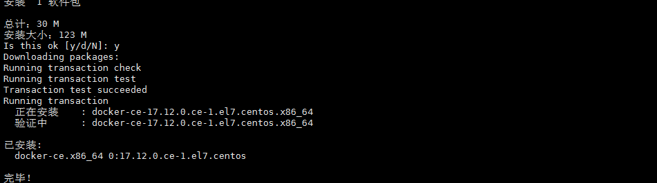
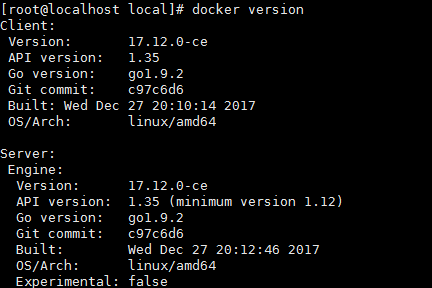

# 安装

# 一、安装docker

1、Docker 要求 CentOS 系统的内核版本高于 3.10 ，查看本页面的前提条件来验证你的CentOS 版本是否支持 Docker 。
通过 uname -r 命令查看你当前的内核版本

```bash
$ uname -r
```

2、使用 root 权限登录 Centos。确保 yum 包更新到最新。
```bash
$ sudo yum update
```
yum update慎用，会升级操作系统和内核版本

3、卸载旧版本(如果安装过旧版本的话)

```bash
$ sudo yum remove docker  docker-common docker-selinux docker-engine
```

4、安装需要的软件包，yum-util 提供yum-config-manager功能，另外两个是devicemapper驱动依赖的

```bash
$ sudo yum install -y yum-utils device-mapper-persistent-data lvm2
```

如果提示这个错误：sudo: yum-config-manager: command not found

这个是因为系统默认没有安装这个命令，这个命令在yum-utils 包里，可以通过命令yum -y install yum-utils 安装就可以了。

5、设置yum源

```bash
$ sudo yum-config-manager --add-repo [https://download.docker.com/linux/centos/docker-ce.repo](https://download.docker.com/linux/centos/docker-ce.repo)
```

阿里云镜像：yum-config-manager --add-repo http://mirrors.aliyun.com/docker-ce/linux/centos/docker-ce.repo


6、可以查看所有仓库中所有docker版本，并选择特定版本安装（可以跳过这步）

$ yum list docker-ce --showduplicates | sort -r


7、安装docker

```bash
$ sudo yum install docker-ce
```

#由于repo中默认只开启stable仓库，故这里安装的是最新稳定版17.12.0

$ sudo yum install <FQPN>  # 例如：sudo yum install docker-ce-17.12.0.ce



8、启动并加入开机启动

```bash
$ sudo systemctl start docker（启动 Docker 后台服务）
$ sudo systemctl enable docker（自动启动）
```

9、验证安装是否成功(有client和service两部分表示docker安装启动都成功了)
```bash
$ docker version
```


## **二、安装问题**

1、因为之前已经安装过旧版本的docker，在安装的时候报错如下：

Transaction check error:

file /usr/bin/docker from install of docker-ce-17.12.0.ce-1.el7.centos.x86_64 conflicts with file from package docker-common-2:1.12.6-68.gitec8512b.el7.centos.x86_64

file /usr/bin/docker-containerd from install of docker-ce-17.12.0.ce-1.el7.centos.x86_64 conflicts with file from package docker-common-2:1.12.6-68.gitec8512b.el7.centos.x86_64

file /usr/bin/docker-containerd-shim from install of docker-ce-17.12.0.ce-1.el7.centos.x86_64 conflicts with file from package docker-common-2:1.12.6-68.gitec8512b.el7.centos.x86_64

file /usr/bin/dockerd from install of docker-ce-17.12.0.ce-1.el7.centos.x86_64 conflicts with file from package docker-common-2:1.12.6-68.gitec8512b.el7.centos.x86_64

2、卸载旧版本的包
```bash
$ sudo yum erase docker-common-2:1.12.6-68.gitec8512b.el7.centos.x86_64
```


3、再次安装docker
```bash
$ sudo yum install docker-ce
```
推荐一种删除docker的方法：

yum remove docker docker-common docker-selinux docker-engine -y

/etc/systemd -name '*docker*' -exec rm -f {} ;

find /etc/systemd -name '*docker*' -exec rm -f {} \;

find /lib/systemd -name '*docker*' -exec rm -f {} \;