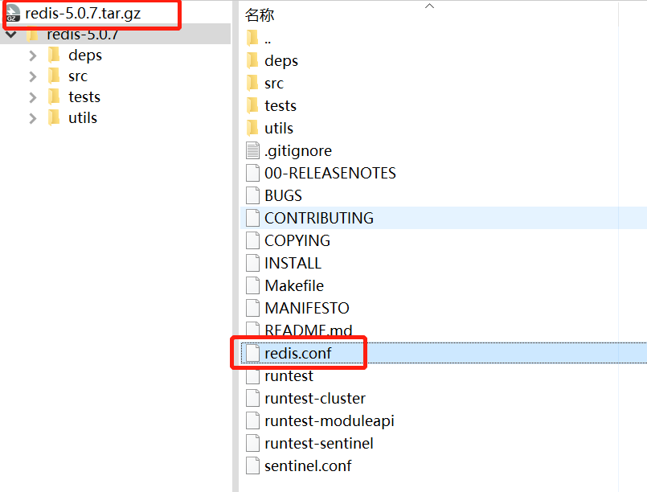

# 安装redis

## 一、拉取镜像

```python
docker pull redis
# 或者指定的版本
docker pull redis:5.0.7
```

## 二、配置文件启动

### 1、创建目录存放redis.conf文件

```python
mkdir ~/redis
cd ~/redis
```

### 2、下载redis.conf文件

进入[官网下载链接](https://download.redis.io/releases/)，下载对应版本，获取对应的redis.conf文件



[**redis.conf 配置示例**](https://zhuanlan.zhihu.com/p/385487380)

### 3、文件授权（不确定是否需要）

#给指定文件授权 chmod 777 redis.conf

### 4、修改默认配置信息

```python
vi /opt/docker_redis/redis.conf

通过#注释掉，解除本地连接限制
bind 127.0.0.1

默认yes， 设置为no，保护模式，限制为本地访问，修改后解除保护模式
protected-mode no

```

## 三、docker启动redis命令

docker run -p 6379:6379 --name redis -v ~/redis/redis.conf:/etc/redis/redis.conf -v ~/redis/data:/data **--restart=always** -d redis redis-server /etc/redis/redis.conf --appendonly yes --requirepass "123456”

进入容器

`docker exec -it redis /bin/bash`