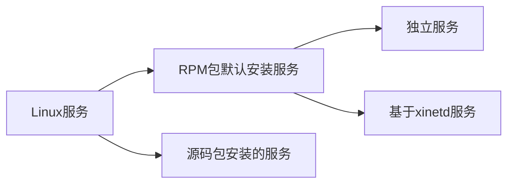

### 1、服务的分类

 - 启动与自启动
   - 服务启动： 就是在当前系统中让服务运行，并提供功能。
   - 服务自启动： 自启动是指让服务在系统开机或重启动之后，随着系统的启动而自动启动服务。

 - 查询已安装的服务
   - RPM包安装的服务
     - chkconfig --list
     - 查看服务自启动状态，可以看到所有RPM包安装的服务
   - 源码包安装的服务
     - 查看服务安装位置，一般是/usr/local/下

 - RPM安装服务和源码包安装服务的区别
   - RPM安装服务和源码包安装服务的区别就是安装位置的不同
     - 源码包安装在指定位置，一般是/usr/local/
     - RPM包安装在默认位置中

### 2.1、RPM服务的管理-独立服务管理

#### 1、 RPM包安装服务的位置
 - RPM安装服务和源码包安装服务的区别就是安装位置的不同
   - 源码包安装在指定位置，一般是/usr/local/
   - RPM包安装在默认位置中

/etc/init.d/： 启动脚本位置
/etc/sysconfig/： 初始化环境配置文件位置
/etc/： 配置文件位置
/etc/xinetd.conf： xinetd配置文件
/etc/xinetd.d/： 基于xinetd服务的启动脚本
/var/lib/： 服务产生的数据放在这里
/var/log/： 日志

