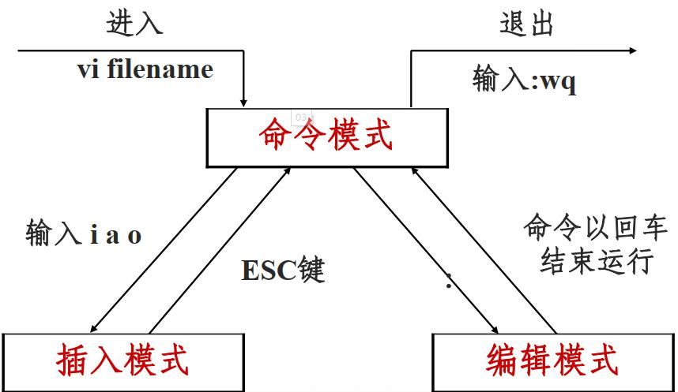

Vim是一个功能强大的全屏幕文本编辑器，是Linux/UNIX上最常用的文本编辑器，它的作用是建立、编辑、显示文本文件。
Vim没有菜单，只有命令。

### Vim 工作模式

### 插入命令
| 命令 | 作用 |
| --- | --- |
| a | 在光标所在字符后插入 |
| A | 在光标所在行尾插入 |
| i | 在光标所在字符前插入 |
| I | 在光标所在行行首插入 |
| o | 在光标下插入新行 |
| O | 在光标上插入新行 |

### 定位命令
| 命令 | 作用 |
| --- | --- |
| : set nu | 设置行号 |
| : set nonu | 取消行号 |
| gg | 到第一行 |
| G | 到最后一行 |
| nG | 到第n行 |
| : n | 到第n行 |

| 命令 | 作用 |
| --- | --- |
| $ | 移至行尾 |
| 0 | 移至行首 |

## 删除命令
| 命令 | 作用 |
| --- | --- |
| x | 删除光标所在处字符 |
| nx | 删除光标所在处后n个字符 |
| dd | 删除光标所在行， ndd删除n行 |
| dG | 删除光标所在行到文件末尾内容 |
| D | 删除光标所在处到行尾内容 |
| :n1,n2d | 删除指定范围的行 |

### 复制和剪切命令
| 命令 | 作用 |
| --- | --- |
| yy | 复制当前行 |
| nyy | 复制当前行以下n行 |
| dd | 剪切当前行 |
| ndd | 剪切当前行以下n行 |
| p、 P | 粘贴在当前光标所在行下或行上 |

### 替换和取消命令
| 命令 | 作用 |
| --- | --- |
| r | 取代光标所在处字符 |
| R | 从光标所在处开始替换字符，按Esc结束 |
| u | 取消上一步操作 |

### 搜索和搜索替换命令
| 命令 | 作用 |
| --- | --- |
| /string | 搜索指定字符串 |
|| 搜索时忽略大小写 :set ic |
| n | 搜索指定字符串的下一个出现位置 |
| :%s/old/new/g | 全文替换指定字符串 |
| :n1,n2s/old/new/g | 在一定范围内替换指定字符串 |

### 保存和退出命令
| 命令 | 作用 |
| --- | --- |
| :w | 保存修改 |
| :w new_filename | 另存为指定文件 |
| :wq | 保存修改并退出 |
| ZZ | 快捷键，保存修改并退出 |
| :q! | 不保存修改退出 |
| :wq! | 保存修改并退出（文件所有者及root可使用） |

##Vim使用技巧
导入命令执行结果：r  !命令
定义快捷键：map  快捷键  触发命令
范例：	：map  ^p  I#<ESC>
：map  ^B  0x
连续行注释	：n1,n2s/^/#/g
：n1,n2s/^#//g
：n1,n2s/^/\/\//g
替换	：ab mymail  samlee@lampbrother.net
